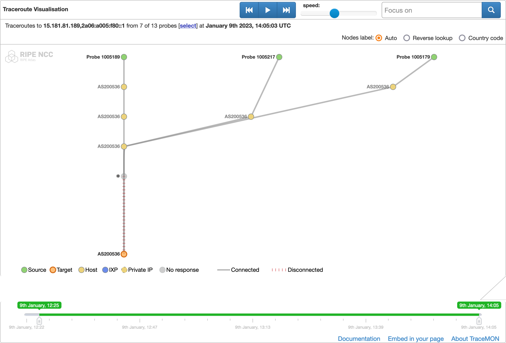

# TraceMON

Visualize network topology generated by Traceroutes from [RIPE Atlas](https://atlas.ripe.net)

## Introduction

TraceMON allows users to visualize network topologies through traceroute analysis. Whether you're a network administrator looking to troubleshoot connectivity issues or simply interested in understanding the inner workings of the internet, TraceMON provides a powerful and intuitive interface for all of your traceroute visualization needs.

Read more: https://labs.ripe.net/Members/massimo_candela/tracemon-traceroute-visualisation-network-debugging-tool

## Getting Started

### Prerequisites
Make sure you have Node.js and npm installed on your machine. You can check if you have them installed by running the following commands in your terminal:

```bash
node -v
npm -v
```

### Installation
Clone the repository and navigate to the project directory:

```bash
git clone https://github.com/robin-rpr/tracemon.git
cd latencymon
```

Install the dependencies:

```bash
npm install
```

### Building the project
To build the project, run the following command:

```bash
npm run build
```
This will create a `dist` directory with the built project files.

### Running the examples
To view the examples, run the following command:

```bash
npm run examples
```
This will start a local server and open the examples in your default browser.

### Running tests
To run the tests, run the following command:

```bash
npm run test
```

This will start a local server and open the examples in your default browser.

## Acknowledgments
If you are using TraceMON or displaying an image of the tool on your website, it is important to include a link to the tool's webpage at https://labs.ripe.net/Members/massimo_candela/tracemon-traceroute-visualisation-network-debugging-tool. This link should be labeled either "About TraceMON" or simply "TreaceMON." If your version of the code does not include this link automatically, please add it manually.

In all references to TraceMON, please be sure to use the correct name of the tool. When sharing a link to a TraceMON instance or an image of the tool on social media, please include the hashtag #TraceMON. It is also important to ensure that the TraceMON and RIPE Atlas watermarks are always visible.

[RIPE Atlas](https://atlas.ripe.net) for providing the latency data.

## License
This project is licensed under the BSD 3-Clause License - see the [LICENSE](./LICENSE) file for details.

## Authors

See the [AUTHORS](./AUTHORS) file for a list of contributors.

TraceMON was developed by RIPE NCC in 2016. If you have any questions about the current status of the tool or need to reach out to the authors, please don't hesitate to contact RIPE NCC for assistance.